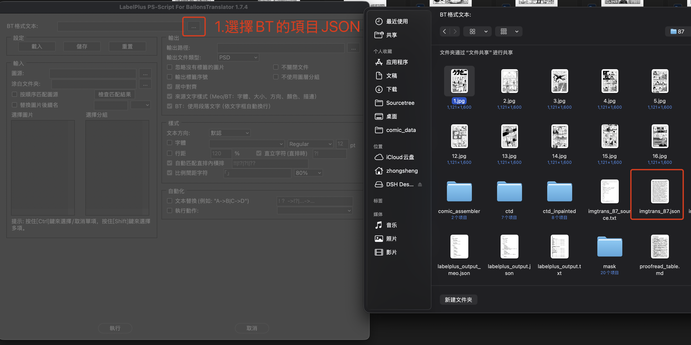
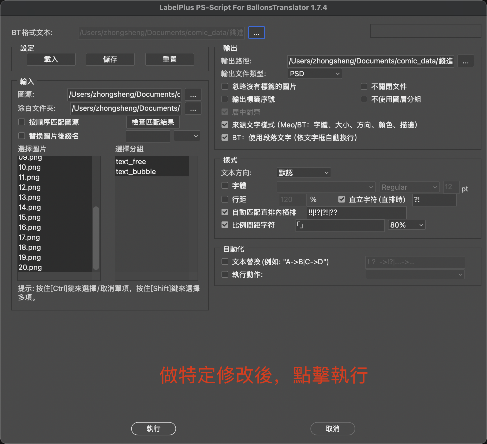

**Language / 語言：** [中文](README.md) | English

# BT-PS-Script

This project is based on [LabelPlus/PS-Script](https://github.com/LabelPlus/PS-Script).

The original project is the Photoshop text-import script in the LabelPlus toolkit: it reads translation text and writes it into PSD layers. This repository adapts that workflow to [BalloonsTranslator](https://github.com/dmMaze/BallonsTranslator) project JSON, so balloon translations, positions, and styles can be imported into Photoshop.

---

## How to use

1. Select the BalloonsTranslator project JSON (for example `imgtrans_*.json`, or `imgtrans_ps.json` exported below).



2. Confirm the image source / output paths, adjust options if needed, then click **Run**. The script will generate the corresponding PSD files.



---

## Export a slim JSON from BalloonsTranslator

**If you import as point text instead of paragraph text: point text will not wrap unless BalloonsTranslator already has manual line breaks (`\n`).** Soft wraps you see in BT are layout only and are not stored in the original project JSON. Run `scripts/export_ps_json.py` first so those visual wraps are written into `translation` as `\n`, then import the resulting `imgtrans_ps.json`.

The script also drops fields this importer does not use, and it does not modify the original project file.

**When to use it**

- Importing as point text, and BT has no manual `\n` (only on-screen auto-wrap) — **you must use this script**, or the PSD text will be one unbroken run.
- You only want the fields this importer reads (translation, boxes, fonts, etc.), not the full project JSON.
- Batch-exporting several projects to `imgtrans_ps.json` for import.

**Usage**

The script uses BalloonsTranslator’s Qt text engine to recover wraps, so `ballontranslator` must be importable (run it in BT’s Python environment). Pass the BT root (the directory that contains the `ballontranslator` package):

```bash
python scripts/export_ps_json.py --bt-root /path/to/BallonsTranslator /path/to/project
```

You can also set `BALLONSTRANSLATOR_ROOT`. If you copy this file back into BT’s own `scripts/` folder, `--bt-root` can be omitted.

Arguments:

- Positional: project folder or an `imgtrans_*.json` path; you can pass more than one project.
- `-o` / `--output`: output path. Default is `imgtrans_ps.json` in that project directory; the original project JSON is never overwritten. Do not reuse one `-o` for multiple projects.
- `--ldpi`: logical DPI for layout, usually `96` or `72`. Try this if wraps do not match what you see in BT.

Examples:

```bash
# Write imgtrans_ps.json in the project directory
python scripts/export_ps_json.py --bt-root /path/to/BallonsTranslator /path/to/project

# Explicit output file
python scripts/export_ps_json.py --bt-root /path/to/BallonsTranslator /path/to/imgtrans_.json -o /tmp/imgtrans_ps.json
```

When importing `imgtrans_ps.json`, uncheck **paragraph text** so point text uses the `\n` written by the script. If paragraph text stays on, text will wrap again inside `xyxy` and you may get double line breaks.

---

## Supported fields

The script reads BalloonsTranslator project JSON (it must include `pages` and `image_info`). Text prefers each balloon’s `translation`; if that is empty, it falls back to source `text`.

When **Source text style** is checked, the following fields are written into Photoshop text layers:

| Field | Description |
|------|------|
| `xyxy` | Balloon box. Used for placement; with paragraph text, text wraps inside this box |
| `translation` / `text` | Layer contents |
| `label` | Layer group name; falls back to `default` if missing |
| `angle` | Rotation |
| `src_is_vertical` | Vertical / horizontal (fallback when `fontformat.vertical` is absent) |
| `fontformat.font_family` | Font (Qt family names are mapped to Photoshop PostScript names when possible) |
| `fontformat.font_size` | Size; falls back to `_detected_font_size` |
| `fontformat.vertical` | Vertical / horizontal |
| `fontformat.bold` / `italic` | Bold, italic |
| `fontformat.frgb` | Text color |
| `fontformat.stroke_width` / `srgb` | Stroke width and color |
| `image_info.width` / `height` | Used to convert box coordinates to relative positions |

Not applied yet: `alignment`, `font_weight`, `line_spacing`, `letter_spacing`.

---

## Download the script

Download `LabelPlus_Ps_Script_BT.jsx` from this repo’s [Releases](https://github.com/FoxyBubbles/BT-PS-Script/releases). You do not need to compile it yourself.

In Photoshop: **File → Scripts → Browse…**, then select the file. To show it in the Scripts menu, copy it into Photoshop’s `Presets/Scripts` folder and restart Photoshop.

Maintainers: see [docs/RELEASE.md](docs/RELEASE.md) for the release process.
